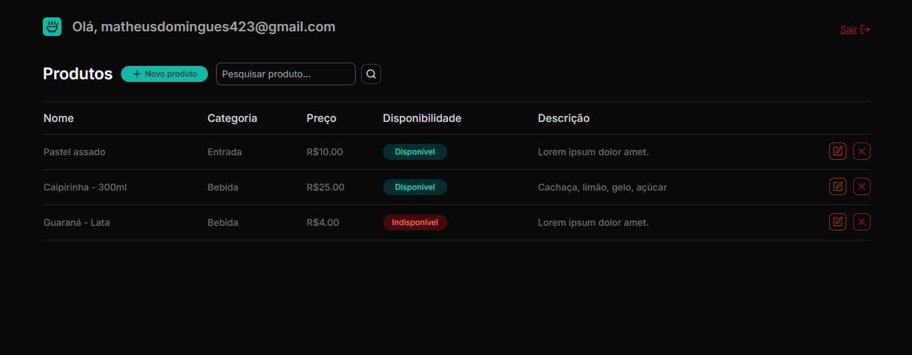

## Teste técnico da CF Sistemas - CRUD

Antes de começar:
- Clone o repositório
- Na raíz, instale as dependências com: 

```bash 
npm install
# ou
yarn install
# ou
pnpm install
```
- Depois, rodar o servidor com:

```bash
npm run dev
# or
yarn dev
# or
pnpm dev
```

## Sobre o projeto

- Tecnologias: [Nextjs], [TypeScript] e [Firebase] para banco de dados e autenticação;
- Fluxo: 
  - Telas de Login e Registro
  - Fluxo de autenticação
  - Tabela de produtos, e CRUD (create, read, update e delete)

  

## Relatórios do app em produção (Vercel)

- Funcionando:
```bash
- Fluxo de autenticação, incluindo lougout
- Listagem dos produtos
- Interações com a interface
```
- Problemas:
```bash
- Nas ações de criar, deletar e editar, os dados da interface não atualizam imediatamente
- Em desenvolvimento, tudo funciona corretamente
```